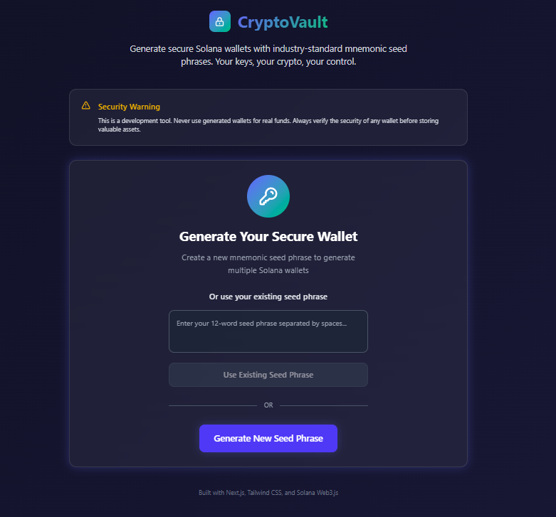
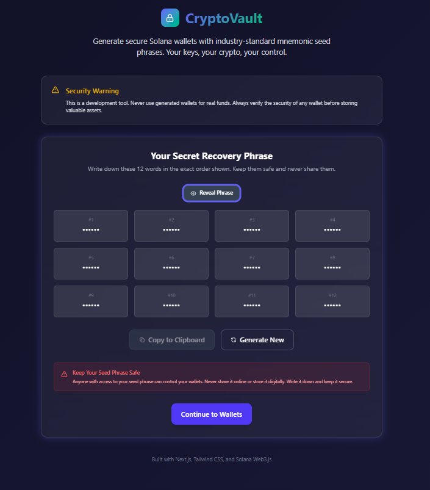
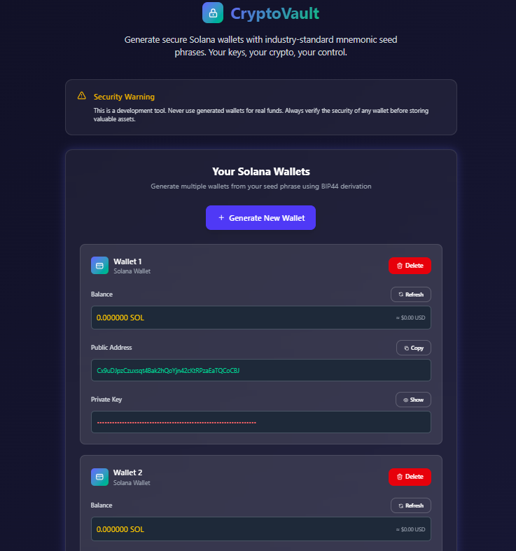

# Crypto Wallet Application

This application is a secure and user-friendly tool for generating and managing Solana wallets using mnemonic seed phrases. It is built with Next.js and leverages the Alchemy API for blockchain interactions.




## Features

1. **Generate Wallets**:
   - Create multiple Solana wallets derived from a single mnemonic seed phrase using the BIP44 derivation path.

2. **View Wallet Details**:
   - Display public addresses and private keys for each wallet.
   - Copy public addresses and private keys to the clipboard with a single click.

3. **Balance Fetching**:
   - Fetch and display the balance of each wallet in SOL.
   - Show approximate USD value based on a fixed conversion rate.
   - "Show Balance" and "Refresh" buttons to control RPC calls and save API usage.

4. **Security Features**:
   - Private keys are hidden by default and can be toggled for visibility.
   - Clear warnings to never share private keys.

5. **Responsive Design**:
   - Modern and clean UI built with Tailwind CSS.
   - Fully responsive for desktop and mobile devices.

## Technologies Used

- **Next.js**: Framework for building the application.
- **Tailwind CSS**: For styling the UI.
- **Solana Web3.js**: For wallet generation and blockchain interactions.
- **Alchemy API**: For fetching wallet balances.
- **BIP39 & ed25519-hd-key**: For mnemonic seed phrase handling and wallet derivation.

## How It Works

1. **Seed Phrase Generation**:
   - Users can generate a new mnemonic seed phrase or input an existing one.
   - The seed phrase is used to derive multiple wallets.

2. **Wallet Management**:
   - Each wallet is displayed with its public address and private key.
   - Users can delete wallets or copy their details.

3. **Balance Fetching**:
   - Users can fetch the balance of any wallet by clicking the "Show Balance" button.
   - The balance is displayed in SOL and USD.

## Environment Variables

The application requires the following environment variables:

- `NEXT_PUBLIC_ALCHEMY_API_KEY`: Your Alchemy API key for interacting with the Solana blockchain.

## Running the Application

1. Clone the repository:
   ```bash
   git clone https://github.com/Rahul-lalwani-learner/Crypto-wallet-with-rpc.git
   ```

2. Install dependencies:
   ```bash
   npm install
   ```

3. Set up the `.env` file with your Alchemy API key:
   ```env
   NEXT_PUBLIC_ALCHEMY_API_KEY=your-alchemy-api-key
   ```

4. Start the development server:
   ```bash
   npm run dev
   ```

5. Open [http://localhost:3000](http://localhost:3000) in your browser.

## Security Notes

- This application is for development and educational purposes only.
- Do not use the generated wallets for storing real funds.
- Always verify the security of any wallet before storing valuable assets.

## Future Enhancements

- Add support for other blockchains.
- Implement real-time SOL to USD conversion rates.
- Enhance error handling and user feedback.

## License

This project is open-source and available under the MIT License.
